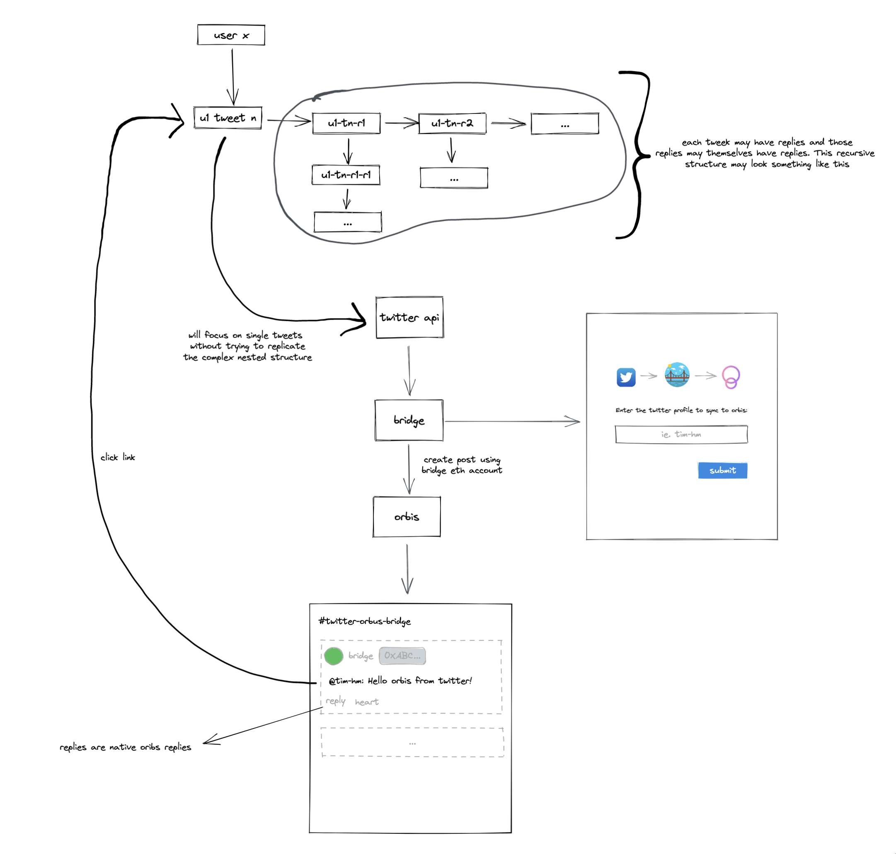

# Twitter -> Bridge -> Orbis

One-way sync of individual tweets.

## Concept / Architecture



## Getting started

1. Run `yarn install` to bring in dependencies. The repo uses yarn pnp so this
    should be fast.
2. Create a `.env` inside backend using `env_example` as a template.
3. From the root run `docker compose -f docker/docker-compose.local.yml up -d`
4. From backend run `yarn start`

## Repo layout

1. Top level is a common mono repo structure.
1. Backend follows a DDD-esque structure where a 'domain' is roughly a
'transactional boundary' or a group of cohesive use cases. Within a domain we
find:
   - `inter` or interfaces which expose functionality outside of the domain so
    that the domain may be "driven"
   - `infra` or infrastructure which are the things the domain "drives" such as
    a database, apis, etc.
   - `service` which brings everything together and exposes the use cases of the
    domain.

## Concepts

1. `Pull` - Retrieval of an accounts tweets from Twitter
2. `Push` - Creates posts inside Orbis corresponding to subscribe users' tweets
3. `Subscribe` - Identifies a twitter account to pull tweets from to push into Orbis

## Api

```http
# Register a twitter user to sync
GET /subscribe/:id

# Pull latest tweets
GET /pull

# Push tweets into orbis / ceramic
GET /push
```
